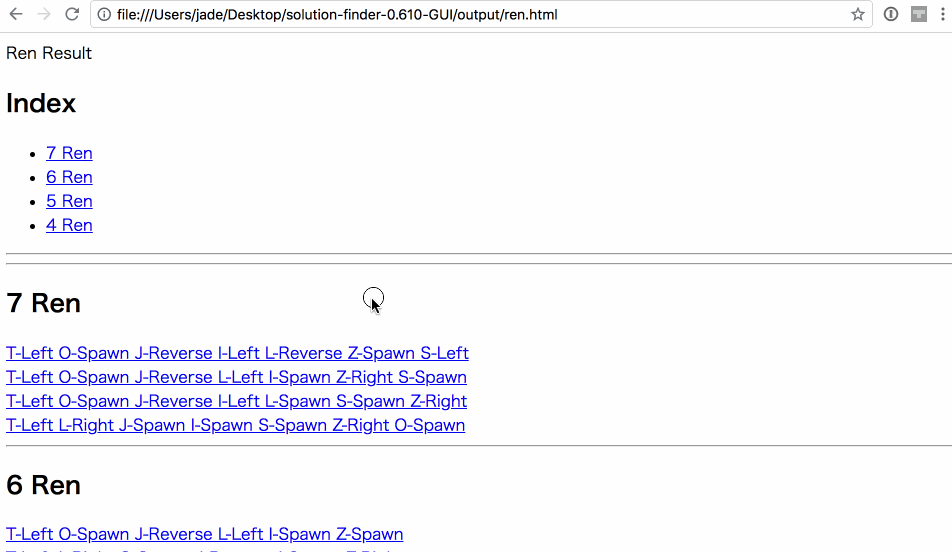
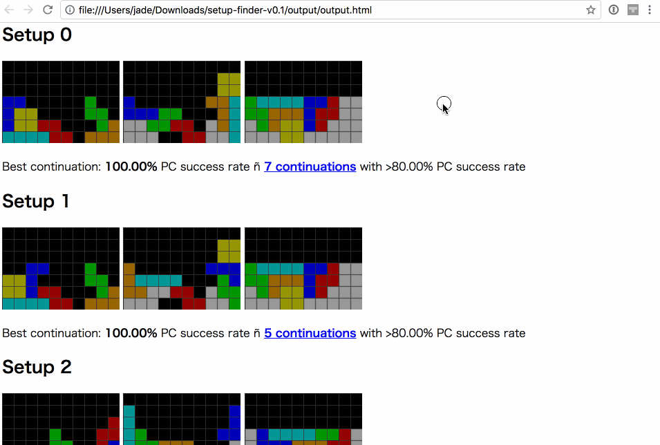
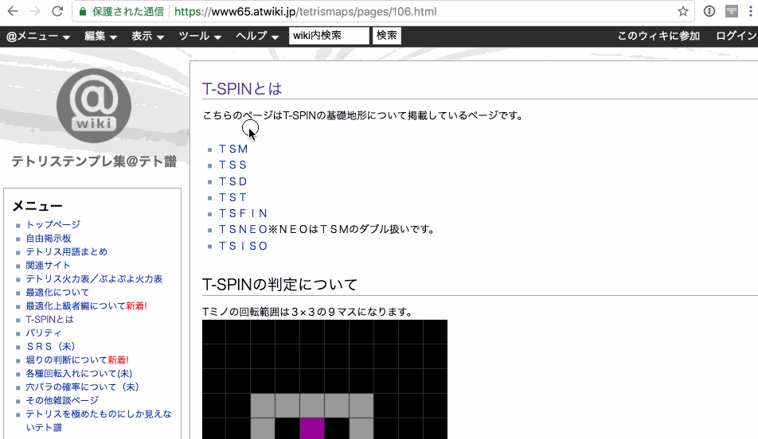

# Fumen Preview Extension

It's Google Chrome extension to quickly view [Fumen for tetris](http://harddrop.com/fumentool).

## Example

with [solution-finder](https://github.com/knewjade/solution-finder)

with [setup-finder](https://github.com/moozilla/setup-finder)

on [テトリステンプレ集＠テト譜](https://www65.atwiki.jp/tetrismaps/)

## Installation

1. Download archived package
2. Extract
3. Load extension directory on chrome (developer mode)

## Supported sites

* [Fumen Tetris Diagram Creator](http://harddrop.com/fumentool) on Harddrop
* [連続テト譜エディタ](http://fumen.zui.jp)

## Supported fumen version

v1.15 only (v115@~, m115@~, d115@~)

## Contact

[Issues on Github](https://github.com/knewjade/fumen-extension/issues)
[Twitter @1millim](https://twitter.com/1millim)